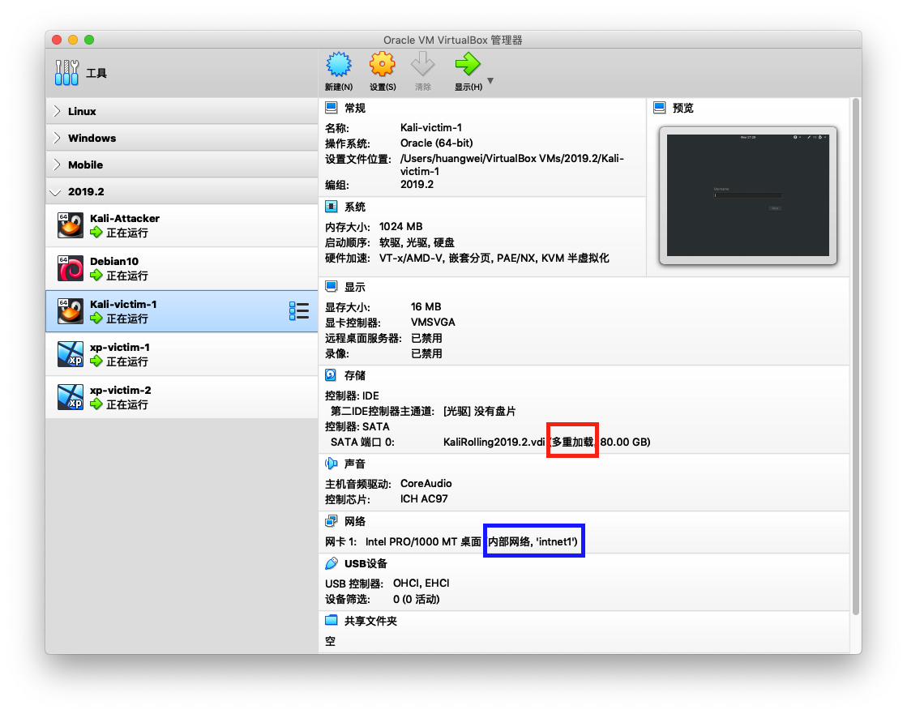

# 基于 VirtualBox 的网络攻防基础环境搭建
## 实验目的：
- 掌握 VirtualBox 虚拟机的安装与使用
- 掌握 VirtualBox 的虚拟网络类型和按需配置
- 掌握 VirtualBox 的虚拟硬盘多重加载
  
## 实验环境：
- VirtualBox 虚拟机
- 攻击者主机（Attacker）：Kali Rolling 2109.2
- 网关（Gateway, GW）：Debian Buster
- 靶机（Victim）：From Sqli to shell / xp-sp3 / Kali

## 实验要求：
- 虚拟硬盘配置成多重加载，效果如下图所示

- 搭建满足如下拓扑图所示的虚拟机网络拓扑

- 完成以下网络连通性测试
  - [👌]靶机可以直接访问攻击者主机
  - [👌]攻击者主机无法直接访问靶机
  - [👌]网关可以直接访问攻击者主机和靶机
  - [👌]靶机的所有对外上下行流量必须经过网关
  - [👌]所有节点均可以访问互联网

## 实验步骤
- 首先配置安装了kali.vdi、debain.vdi、windows xp.vdi的多重加载硬盘，分别设置成  Victim、Gateway、Attacker的虚拟机
- 配置三种类型虚拟机的多种类型网卡
- 通过虚拟机实现网络连通性测试

## 具体内容

### 一、配置安装了kali.vdi、debain.vdi、windows xp.vdi的多重加载硬盘，分别设置成类型名为  Victim、Gateway、Attacker的虚拟机

### 说明：先释放盘片，再实现多重加载；其余的debain.vdi和xp.vdi均可在课件中直接下载

### 二、给三种虚拟机添加适配的网卡，在这里我为了实验要求创建了5个虚拟机
- kali(主机)：网络地址转换NAT(eth0)、Host only网络#2(eth1)
- xp-victim1(靶机)：内部网络 intnet1(eth0)
- kali-victim2(靶机)：内部网络 intnet(eth0)
- debain-gateway(网关)：Nat网络(eth0)、Host only网络#2(eth1)、内部网络intnet1(eth2)、内部网络intnet(eth3)
- attacker（攻击者）：Nat网络(eth0)  

   配置成功:  
      xp-victim1:
     
      kali-victim2:  
     
      debain-gateway:
     
      attacker:
      

### 三、连通性验证

- 靶机可以直接访问攻击者主机

  1.靶机向攻击者主机(10.0.2.15)发送包  
  2.攻击者主机通过tcpdump来抓包，这里通过实验发现发送的4个包均被抓到  
  
  

- 攻击者主机无法直接访问靶机 

  1.攻击者主机向靶机(172.16.222.100)发送包  
  2.靶机无法正常接收
  
   

- 网关可以直接访问攻击者主机和靶机

  1.网关分别向靶机(172.16.222.100)和攻击者(10.0.2.15)发送包  
  2.分别用靶机和攻击者进行抓包，都能抓到相应的数据包
  
  
  
  
      
- 靶机的所有对外上下行流量必须经过网关

  1.靶机先来访问 www.baidu.com  
  2.网关实时进行抓包，抓到请求数据包  
    
    

  3.靶机来访问攻击者  
  4.网关实时进行抓包，抓到请求数据包  
    
    

- 所有节点均可以访问互联网  
  1.靶机访问互联网
    
  2.攻击者访问互联网  
    
  3.网关访问互联网  
  

## 实验问题：
- Linux中tcpdump抓包速度太慢并且伴随着掉包的情况